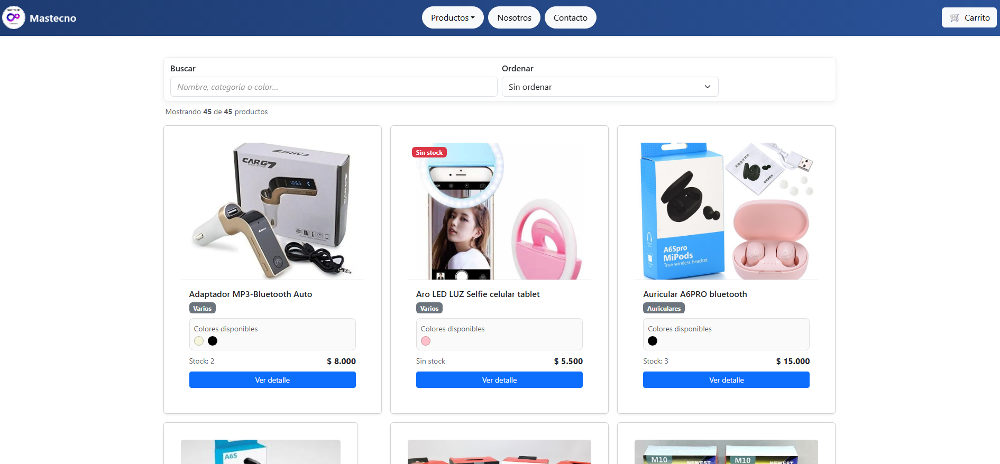

# Carrito de compras MasTecno

Aplicación web de e-commerce para **MasTecno** construida con **React + Vite**. Permite explorar productos, ver detalles con variaciones (colores), administrar el carrito y avanzar al checkout. Incluye navegación por categorías, buscador y diseño con **Bootstrap**.

> **Demo**: https://jjpiriz.com.ar/MasTecno

---

## 🧩 Características

- Listado de productos con categorías.
- Detalle de producto con colores, stock y botón de compra.
- Carrito global con **Context API** (sumar/restar/eliminar y totales).
- Búsqueda y **filtro por categorías** (React Router).
- UI con **Bootstrap 5** + estilos locales.
- Manejo de estados y diálogos con **SweetAlert2**.
- Servicios HTTP con **Axios**.
- Soporte para despliegue bajo subruta (`/MasTecno`).

## 📦 Instalación

> Requisitos: **Node.js 18+** y **npm**.

```bash
git clone https://github.com/JJPIRIZ/CodeHouseReact.git
cd CoderHouseReact   # si la carpeta clonada se llama CodeHouseReact, usa: cd CodeHouseReact
npm install
npm run dev
```

### Variables de entorno (opcional)
Si servís bajo una subruta:

```bash
VITE_BASE_URL=/MasTecno/
```

## 🚀 Scripts disponibles

- `npm run dev` — entorno de desarrollo con Vite
- `npm run build` — build de producción en `/dist`
- `npm run preview` — prueba local del build

## 🛠️ Tecnologías

- **React 18**, **Vite**
- **React Router**
- **Context API**
- **Axios**
- **Bootstrap 5**
- **SweetAlert2**

## 🗂️ Estructura de archivos

```text
📂 MasTecno/
├── docs/
│   └── produccion.png
├── src/
│   ├── assets/
│   │   └── react.svg
│   ├── components/
│   │   ├── CartWidget/
│   │   │   ├── CartWidget.css
│   │   │   └── CartWidget.jsx
│   │   ├── ItemCard/
│   │   │   ├── ItemCard.css
│   │   │   └── ItemCard.jsx
│   │   ├── ItemDetail/
│   │   │   ├── ItemCount.jsx
│   │   │   ├── ItemDetail.css
│   │   │   └── ItemDetail.jsx
│   │   ├── ItemDetailContainer/
│   │   │   └── ItemDetailContainer.jsx
│   │   ├── ItemListContainer/
│   │   │   ├── ItemListContainer.css
│   │   │   └── ItemListContainer.jsx
│   │   ├── NavBar/
│   │   │   ├── NavBar.css
│   │   │   └── NavBar.jsx
│   │   └── SmartImage/
│   │       └── SmartImage.jsx
│   ├── context/
│   │   ├── CartContext.jsx
│   │   └── ProductsContext.jsx
│   ├── hooks/
│   │   └── useCart.js
│   ├── pages/
│   │   ├── AdminHome.jsx
│   │   ├── AdminImport.jsx
│   │   ├── AdminOrders.jsx
│   │   ├── AdminProducts.jsx
│   │   ├── Cart.jsx
│   │   ├── Checkout.jsx
│   │   ├── Contacto.jsx
│   │   ├── Nosotros.jsx
│   │   └── NotFound.jsx
│   ├── services/
│   │   ├── ordersService.js
│   │   ├── productosService.js
│   │   ├── productsService.js
│   │   ├── sheetsService.js
│   │   └── uploader.js
│   ├── utils/
│   │   ├── adminSession.js
│   │   ├── images.js
│   │   ├── inventory.js
│   │   ├── number.js
│   │   ├── pricing.js
│   │   └── strings.js
│   ├── App.css
│   ├── App.jsx
│   ├── firebase.js
│   ├── index.css
│   └── main.jsx
├── .env.local
├── .gitignore
├── eslint.config.js
├── index.html
├── package-lock.json
├── package.json
├── README.md
└── vite.config.js
```

> Se omiten automáticamente carpetas pesadas como `node_modules/` o artefactos de build.

## 🖼️ Capturas de pantalla



> Si no se ve la imagen, asegurate de tener `./docs/produccion.png` en el repo (ya incluida en este proyecto).

## 🔧 Configuración rápida de rutas e imágenes

- Si publicás en `https://dominio.com/MasTecno`, configurá `VITE_BASE_URL=/MasTecno/` y usá `import.meta.env.BASE_URL` para rutas de imágenes y assets.
- Recomendación para imágenes: usar nombres sin espacios ni caracteres especiales (p. ej., `Tripode-celular.jpg`).

## 🤝 Contribución

1. Hacé fork del repo.
2. Creá una rama: `git checkout -b feature/mi-mejora`.
3. Commit: `git commit -m "feat: agrego X"`.
4. Push: `git push origin feature/mi-mejora`.
5. Abrí un PR con descripción y capturas si corresponde.

> Sugerencia: **Conventional Commits** (feat, fix, docs, chore, refactor, style…)

## 📄 Licencia

Distribuido bajo licencia **MIT**.

## 🔗 Enlaces

- **Producción**: https://jjpiriz.com.ar/MasTecno
- **Repositorio**: https://github.com/JJPIRIZ/CodeHouseReact
- **Autor**: Javier Piriz — https://jjpiriz.com.ar

---

### Descargas de documentación

- **README (PDF)**: [./docs/README.pdf](./docs/README.pdf)
